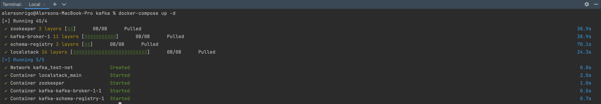
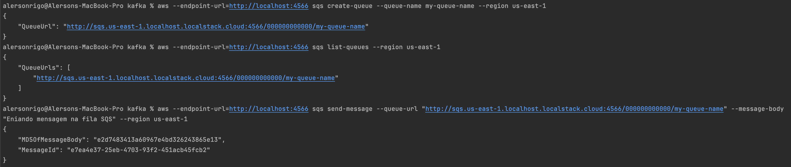
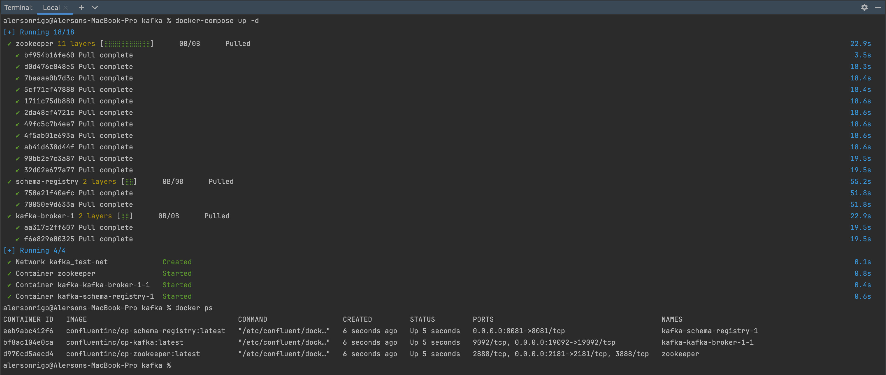
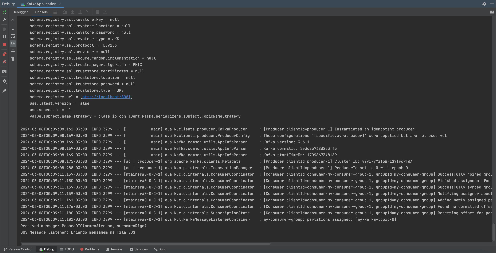

**SPRING BOOT 3.2.3**

This project serves as a comprehensive guide on configuring a virtualized environment using Docker, specifically tailored for running applications leveraging pivotal technologies such as Kafka and AWS SQS (Amazon Simple Queue Service).
The initiative meticulously outlines the integration and functionality of key components, including Kafka Producers, Consumers, and ErrorHandlers, alongside the robust AWS SQS, to facilitate seamless message queuing and processing.
***Key Features***

- **Producer:** Architectured to efficiently produce and dispatch messages onto a Kafka topic, serving as the initiating point of the message flow.
- **Consumer:** Configured to diligently read and process messages from the designated Kafka topic, illustrating seamless message consumption.
- **ErrorHandler:** A resilient component designed to intercept and manage exceptions that emerge during the consumption process, ensuring the application's robustness and stability.
- **Bean Validation:** Integrated to perform preliminary validation of bean properties, ensuring that only data meeting predefined constraints progresses through the workflow.
- **Avro:** Avro is a row-oriented remote procedure call and data serialization framework developed within Apache's Hadoop project. It uses JSON for defining data types and protocols, and serializes data in a compact binary format.
- **SQS:** Amazon Simple Queue Service (SQS) provides a scalable and reliable message queuing solution, allowing for the asynchronous transmission, storage, and retrieval of messages across software components, irrespective of volume. It ensures message delivery without loss, eliminating the dependency on other services being continuously available.

***Getting Started***

To explore and run this application locally, please ensure the following prerequisites are met:

**Docker Installation:** Docker needs to be installed and running on your machine. It's pivotal for containerizing the Kafka broker and streamlining the setup process.
Running the Application

**Initialize Kafka:** Navigate to the root directory of the application, where the docker-compose.yml file is situated. Execute the command docker-compose up -d to spin up the Kafka broker (and any other services defined) in detached mode. This step prepares the environment for message brokering. 
Application Execution: With the Kafka broker up and running, you're now set to launch the Spring Boot application. Follow the standard Spring Boot application running procedures to kickstart the service.

- Run the command: **docker-compose up -d** at the root of the application where the **docker-compose.yml** file is located.

**docker-compose up -d**

**After initializing the Docker containers, execute the following commands:**

- Create an SQS queue.
- List the SQS queue (to ensure the SQS queue has been created).
- Send a message to the SQS queue.
- NOTE: The commands can be found in the "init-localstack.sh" file.

The **Kafka message** is being sent by the application's main class. A Bean was created using the CommandLineRunner interface, into which an instance of the Producer is injected to send the message.

**Console log**

**This publication aims to elucidate the practical application and benefits of integrating these technologies into a Dockerized environment, paving the way for developers to harness the power of virtualization and messaging systems in their applications.**