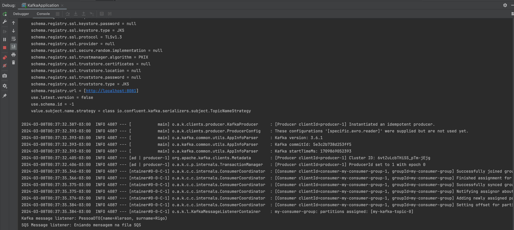

This Spring Boot application demonstrates a robust integration with Apache Kafka, showcasing key components for effective message handling in a distributed system. Designed to serve both as an educational tool and a practical template, the application encapsulates the essentials of Kafka's Producer and Consumer mechanisms, enriched with sophisticated error handling and data validation strategies.

***Key Features***

- **Producer:** Architectured to efficiently produce and dispatch messages onto a Kafka topic, serving as the initiating point of the message flow.
- **Consumer:** Configured to diligently read and process messages from the designated Kafka topic, illustrating seamless message consumption.
- **ErrorHandler:** A resilient component designed to intercept and manage exceptions that emerge during the consumption process, ensuring the application's robustness and stability.
- **Bean Validation:** Integrated to perform preliminary validation of bean properties, ensuring that only data meeting predefined constraints progresses through the workflow.
- **Avro:** Avro is a row-oriented remote procedure call and data serialization framework developed within Apache's Hadoop project. It uses JSON for defining data types and protocols, and serializes data in a compact binary format.

***Getting Started***

To explore and run this application locally, please ensure the following prerequisites are met:

**Docker Installation:** Docker needs to be installed and running on your machine. It's pivotal for containerizing the Kafka broker and streamlining the setup process.
Running the Application

**Initialize Kafka:** Navigate to the root directory of the application, where the docker-compose.yml file is situated. Execute the command docker-compose up -d to spin up the Kafka broker (and any other services defined) in detached mode. This step prepares the environment for message brokering. 
Application Execution: With the Kafka broker up and running, you're now set to launch the Spring Boot application. Follow the standard Spring Boot application running procedures to kickstart the service.

- Run the command: **docker-compose up -d** at the root of the application where the **docker-compose.yml** file is located.

**docker-compose up -d**

The message is being sent by the application's main class. A Bean was created using the CommandLineRunner interface, into which an instance of the Producer is injected to send the message.

**Console log**

